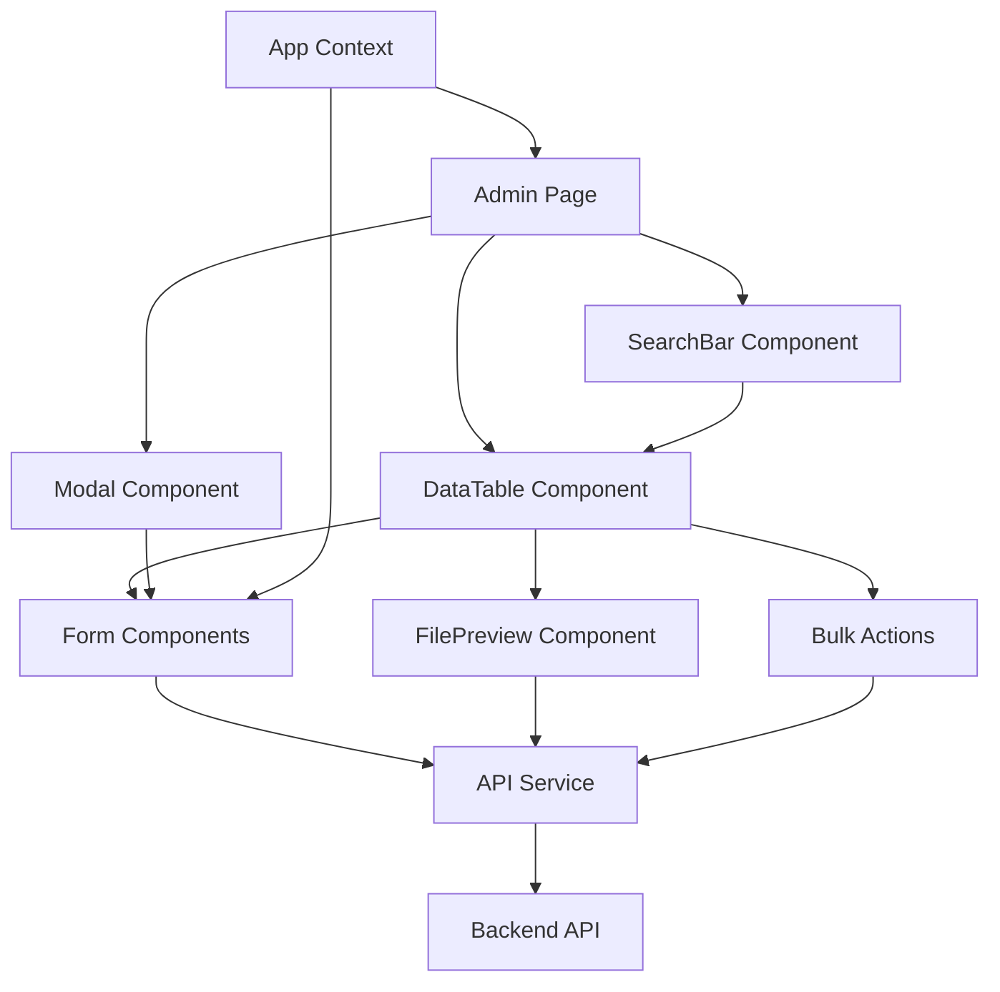

# Admin Page Implementation Architecture

## Overview
This document outlines the architecture for implementing comprehensive CRUD functionality for the admin panel, including modal forms, validation, search/filter, bulk operations, and file preview.

## Components Structure

```
src/
├── app/
│   └── admin/
│       ├── page.tsx (Dashboard - already implemented)
│       ├── login/page.tsx (Login - already implemented)
│       ├── announcements/page.tsx (Announcements CRUD)
│       ├── files/page.tsx (Files CRUD)
│       ├── modules/page.tsx (Modules CRUD)
│       └── nilai/page.tsx (Nilai CRUD)
├── components/
│   ├── ui/
│   │   ├── Button.tsx (already exists)
│   │   ├── Card.tsx (already exists)
│   │   ├── Badge.tsx (already exists)
│   │   └── LoadingSpinner.tsx (already exists)
│   ├── shared/
│   │   ├── DataTable.tsx (already exists - will enhance)
│   │   ├── FileUpload.tsx (already exists)
│   │   ├── PasswordModal.tsx (already exists)
│   │   ├── Modal.tsx (new - reusable modal)
│   │   ├── SearchBar.tsx (new - for search/filter)
│   │   └── FilePreview.tsx (new - for file preview)
│   ├── forms/
│   │   ├── AnnouncementForm.tsx (new)
│   │   ├── FileForm.tsx (new)
│   │   ├── ModuleForm.tsx (new)
│   │   └── NilaiForm.tsx (new)
│   └── layout/
│       ├── AdminLayout.tsx (already exists)
│       └── AdminSidebar.tsx (will update - remove sliders)
```

## Data Flow Architecture



## Implementation Details

### 1. Modal Component
- Reusable modal for all forms
- Support for different sizes
- Backdrop click to close
- Loading states
- Form validation display

### 2. Form Components
Each entity will have its own form component:
- **AnnouncementForm**: Title, content, attachments, importance flag
- **FileForm**: Name, description, visibility, password protection
- **ModuleForm**: Title, description, visibility, file upload
- **NilaiForm**: Class, cohort, file upload, password protection

### 3. Enhanced DataTable
- Search functionality
- Column sorting
- Pagination
- Row selection for bulk actions
- Loading states
- Empty state handling

### 4. File Preview
- Support for PDF preview
- Image preview
- Document metadata display
- Download functionality

### 5. Bulk Operations
- Multi-select checkboxes
- Bulk delete with confirmation
- Select all functionality

## API Integration

All CRUD operations will use the existing API service in `src/lib/api.ts`:

### Endpoints to be used:
- `GET /api/announcements` - List announcements
- `POST /api/announcements` - Create announcement
- `PUT /api/announcements/:id` - Update announcement
- `DELETE /api/announcements/:id` - Delete announcement
- `GET /api/files` - List files
- `POST /api/files` - Upload file
- `PUT /api/files/:id` - Update file
- `DELETE /api/files/:id` - Delete file
- Similar patterns for modules and nilai

## Form Validation Rules

### Announcements
- Title: Required, max 200 characters
- Content: Required, max 5000 characters
- Attachments: Optional, max 5 files, each max 10MB

### Files
- Name: Required, max 100 characters
- Description: Optional, max 500 characters
- File: Required, max 10MB
- Password: Optional if password protection enabled

### Modules
- Title: Required, max 200 characters
- Description: Required, max 1000 characters
- File: Required, max 10MB

### Nilai
- Class: Required, max 50 characters
- Cohort: Required, max 50 characters
- File: Required, max 10MB
- Password: Optional if password protection enabled

## User Experience Flow

1. **List View**: Users see a searchable, paginated table of items
2. **Create**: Click "Add" button → Modal form opens → Fill form → Submit → Item added to list
3. **Edit**: Click edit icon → Modal form opens with existing data → Modify → Submit → Item updated
4. **Delete**: Click delete icon → Confirmation dialog → Item removed
5. **Bulk Delete**: Select multiple items → Click bulk delete → Confirmation → Items removed
6. **Preview**: Click preview icon → File preview modal opens

## Error Handling

- Form validation errors displayed inline
- API errors shown as notifications
- Network errors with retry options
- Loading states for all async operations

## Security Considerations

- All forms protected against XSS
- File type validation on upload
- Size limits enforced
- Password protection for sensitive files
- Admin authentication required for all operations

## Performance Optimizations

- Pagination for large datasets
- Debounced search input
- Lazy loading for file previews
- Optimistic updates for better UX
- Proper cleanup of modals and event listeners